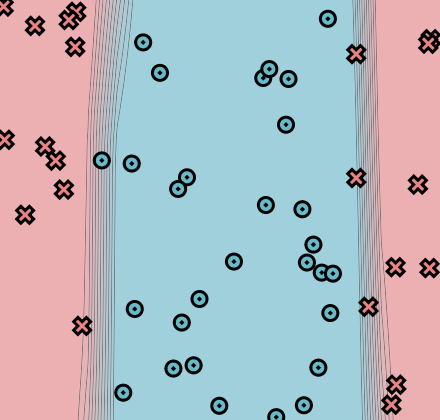

[](https://classroom.github.com/a/YFgwt0yY)
# MiniTorch Module 2


* Docs: https://minitorch.github.io/

* Overview: https://minitorch.github.io/module2/module2/

This assignment requires the following files from the previous assignments. You can get these by running

```bash
python sync_previous_module.py previous-module-dir current-module-dir
```

The files that will be synced are:

        minitorch/operators.py minitorch/module.py minitorch/autodiff.py minitorch/scalar.py minitorch/scalar_functions.py minitorch/module.py project/run_manual.py project/run_scalar.py project/datasets.py

## Simple Dataset (Hidden Layer 3, LR of 0.1)

Time per epoch: 0.057 seconds

### Plot


### Loss Graph


### Loss Data
Epoch: 0/500, loss: 0, correct: 0\
Epoch: 10/500, loss: 35.79974388362853, correct: 20\
Epoch: 20/500, loss: 34.07633936611292, correct: 31\
Epoch: 30/500, loss: 33.45595397466262, correct: 30\
Epoch: 40/500, loss: 33.037221008527546, correct: 30\
Epoch: 50/500, loss: 32.65814794263026, correct: 30\
Epoch: 60/500, loss: 32.36573216568706, correct: 30\
Epoch: 70/500, loss: 32.09888682594517, correct: 30\
Epoch: 80/500, loss: 31.78087887691952, correct: 30\
Epoch: 90/500, loss: 31.401648349957522, correct: 30\
Epoch: 100/500, loss: 30.943264689457532, correct: 30\
Epoch: 110/500, loss: 30.386477035192144, correct: 30\
Epoch: 120/500, loss: 29.709221627240574, correct: 34\
Epoch: 130/500, loss: 28.88751157088813, correct: 40\
Epoch: 140/500, loss: 27.91027422808082, correct: 42\
Epoch: 150/500, loss: 26.762992161781263, correct: 44\
Epoch: 160/500, loss: 25.48795083311222, correct: 48\
Epoch: 170/500, loss: 24.153502468182293, correct: 49\
Epoch: 180/500, loss: 22.73549685310775, correct: 49\
Epoch: 190/500, loss: 21.264818988626203, correct: 49\
Epoch: 200/500, loss: 19.815145569534813, correct: 50\
Epoch: 210/500, loss: 18.453067537174537, correct: 50\
Epoch: 220/500, loss: 17.171793727078747, correct: 50\
Epoch: 230/500, loss: 15.957068405235526, correct: 50\
Epoch: 240/500, loss: 14.840669361964773, correct: 50\
Epoch: 250/500, loss: 13.813782277493521, correct: 50\
Epoch: 260/500, loss: 12.885099659698593, correct: 50\
Epoch: 270/500, loss: 12.046455434202016, correct: 50\
Epoch: 280/500, loss: 11.292133286090673, correct: 50\
Epoch: 290/500, loss: 10.61044496014656, correct: 50\
Epoch: 300/500, loss: 9.993942127078078, correct: 50\
Epoch: 310/500, loss: 9.43047208070305, correct: 50\
Epoch: 320/500, loss: 8.9144434150001, correct: 50\
Epoch: 330/500, loss: 8.443309050410086, correct: 50\
Epoch: 340/500, loss: 8.015466310946714, correct: 50\
Epoch: 350/500, loss: 7.62644334905007, correct: 50\
Epoch: 360/500, loss: 7.269076182527271, correct: 50\
Epoch: 370/500, loss: 6.938683785750776, correct: 50\
Epoch: 380/500, loss: 6.634211435905774, correct: 50\
Epoch: 390/500, loss: 6.355161348527034, correct: 50\
Epoch: 400/500, loss: 6.097478803005744, correct: 50\
Epoch: 410/500, loss: 5.858628878797319, correct: 50\
Epoch: 420/500, loss: 5.636382704123928, correct: 50\
Epoch: 430/500, loss: 5.428399153277882, correct: 50\
Epoch: 440/500, loss: 5.233402421116185, correct: 50\
Epoch: 450/500, loss: 5.0503015753047675, correct: 50\
Epoch: 460/500, loss: 4.878082312366759, correct: 50\
Epoch: 470/500, loss: 4.715875687725097, correct: 50\
Epoch: 480/500, loss: 4.562879752884203, correct: 50\
Epoch: 490/500, loss: 4.418378072326041, correct: 50\
Epoch: 500/500, loss: 4.28173139512602, correct: 50

## Diag Dataset (Hidden Layer 7, LR of 0.1)

Time per epoch: 0.166 seconds

### Plot


### Loss Graph


### Loss Data
Epoch: 0/700, loss: 0, correct: 0\
Epoch: 10/700, loss: 16.15585018659756, correct: 45\
Epoch: 20/700, loss: 15.222759656698303, correct: 45\
Epoch: 30/700, loss: 14.962123333216505, correct: 45\
Epoch: 40/700, loss: 14.785846384798345, correct: 45\
Epoch: 50/700, loss: 14.615495038536755, correct: 45\
Epoch: 60/700, loss: 14.43661792229324, correct: 45\
Epoch: 70/700, loss: 14.25326591740423, correct: 45\
Epoch: 80/700, loss: 14.057794461547278, correct: 45\
Epoch: 90/700, loss: 13.848876190354073, correct: 45\
Epoch: 100/700, loss: 13.62562942818922, correct: 45\
Epoch: 110/700, loss: 13.388049135778978, correct: 45\
Epoch: 120/700, loss: 13.134028658114016, correct: 45\
Epoch: 130/700, loss: 12.8613167475171, correct: 45\
Epoch: 140/700, loss: 12.569526156923962, correct: 45\
Epoch: 150/700, loss: 12.259267227912103, correct: 45\
Epoch: 160/700, loss: 11.930487889344306, correct: 45\
Epoch: 170/700, loss: 11.583323387069074, correct: 45\
Epoch: 180/700, loss: 11.218592025463543, correct: 45\
Epoch: 190/700, loss: 10.837914005921785, correct: 45\
Epoch: 200/700, loss: 10.443244155812776, correct: 45\
Epoch: 210/700, loss: 10.037067702699321, correct: 45\
Epoch: 220/700, loss: 9.639252008592292, correct: 45\
Epoch: 230/700, loss: 9.243751497658824, correct: 45\
Epoch: 240/700, loss: 8.855282974785545, correct: 45\
Epoch: 250/700, loss: 8.47337616697259, correct: 45\
Epoch: 260/700, loss: 8.102677360465723, correct: 45\
Epoch: 270/700, loss: 7.7409610802462305, correct: 46\
Epoch: 280/700, loss: 7.393709162228185, correct: 46\
Epoch: 290/700, loss: 7.06227008246727, correct: 46\
Epoch: 300/700, loss: 6.744325967768364, correct: 47\
Epoch: 310/700, loss: 6.486257966233686, correct: 47\
Epoch: 320/700, loss: 6.242615175552369, correct: 47\
Epoch: 330/700, loss: 6.009275548623733, correct: 47\
Epoch: 340/700, loss: 5.7873313477601735, correct: 47\
Epoch: 350/700, loss: 5.575430027339238, correct: 47\
Epoch: 360/700, loss: 5.3740324844899146, correct: 47\
Epoch: 370/700, loss: 5.182395232831971, correct: 48\
Epoch: 380/700, loss: 5.001287945459113, correct: 48\
Epoch: 390/700, loss: 4.829671028584298, correct: 48\
Epoch: 400/700, loss: 4.6668510845009274, correct: 48\
Epoch: 410/700, loss: 4.511155448651602, correct: 48\
Epoch: 420/700, loss: 4.363732886187844, correct: 49\
Epoch: 430/700, loss: 4.223651879582099, correct: 49\
Epoch: 440/700, loss: 4.091007475308929, correct: 49\
Epoch: 450/700, loss: 3.963414618344529, correct: 49\
Epoch: 460/700, loss: 3.8466726277925574, correct: 49\
Epoch: 470/700, loss: 3.7357925572883697, correct: 49\
Epoch: 480/700, loss: 3.629909145394336, correct: 49\
Epoch: 490/700, loss: 3.5305883316812636, correct: 49\
Epoch: 500/700, loss: 3.4330999915009452, correct: 49\
Epoch: 510/700, loss: 3.340876688761358, correct: 49\
Epoch: 520/700, loss: 3.2526176729980567, correct: 49\
Epoch: 530/700, loss: 3.167284262889976, correct: 49\
Epoch: 540/700, loss: 3.0847869748103385, correct: 49\
Epoch: 550/700, loss: 3.0055205962230307, correct: 49\
Epoch: 560/700, loss: 2.929426162386546, correct: 49\
Epoch: 570/700, loss: 2.8562904222541485, correct: 49\
Epoch: 580/700, loss: 2.7850702722400125, correct: 49\
Epoch: 590/700, loss: 2.7164451077607126, correct: 50\
Epoch: 600/700, loss: 2.650209787709831, correct: 50\
Epoch: 610/700, loss: 2.5875805597510553, correct: 50\
Epoch: 620/700, loss: 2.527143650285205, correct: 50\
Epoch: 630/700, loss: 2.46922406374246, correct: 50\
Epoch: 640/700, loss: 2.4127926296283806, correct: 50\
Epoch: 650/700, loss: 2.3595877355404333, correct: 50\
Epoch: 660/700, loss: 2.309098666332852, correct: 50\
Epoch: 670/700, loss: 2.2582823640606207, correct: 50\
Epoch: 680/700, loss: 2.210444034081056, correct: 50\
Epoch: 690/700, loss: 2.1650931250476275, correct: 50\
Epoch: 700/700, loss: 2.1185960190184208, correct: 50

## Split Dataset (Hidden Layer 12, LR of 0.1)

Time per epoch: 0.367 seconds

### Plot


### Loss Graph


### Loss Data
Epoch: 0/1000, loss: 0, correct: 0\
Epoch: 10/1000, loss: 33.32125028178119, correct: 36\
Epoch: 20/1000, loss: 32.43406177287252, correct: 31\
Epoch: 30/1000, loss: 31.86828015426277, correct: 31\
Epoch: 40/1000, loss: 31.422921540769504, correct: 31\
Epoch: 50/1000, loss: 31.00112939017478, correct: 31\
Epoch: 60/1000, loss: 30.593588716382808, correct: 32\
Epoch: 70/1000, loss: 30.19744861985537, correct: 32\
Epoch: 80/1000, loss: 29.803467322531425, correct: 32\
Epoch: 90/1000, loss: 29.428613928602505, correct: 33\
Epoch: 100/1000, loss: 29.054932306045334, correct: 33\
Epoch: 110/1000, loss: 28.657977036291058, correct: 33\
Epoch: 120/1000, loss: 28.25172356979529, correct: 33\
Epoch: 130/1000, loss: 27.811961465048352, correct: 33\
Epoch: 140/1000, loss: 27.33547972427748, correct: 38\
Epoch: 150/1000, loss: 26.827142872556266, correct: 38\
Epoch: 160/1000, loss: 26.29908090480736, correct: 38\
Epoch: 170/1000, loss: 25.732064844378616, correct: 40\
Epoch: 180/1000, loss: 25.160292995822786, correct: 40\
Epoch: 190/1000, loss: 24.565238327326554, correct: 41\
Epoch: 200/1000, loss: 23.939393117777605, correct: 41\
Epoch: 210/1000, loss: 23.29246380501955, correct: 42\
Epoch: 220/1000, loss: 22.6421170213034, correct: 42\
Epoch: 230/1000, loss: 21.966125245814922, correct: 43\
Epoch: 240/1000, loss: 21.279325410393007, correct: 43\
Epoch: 250/1000, loss: 20.590873618563496, correct: 45\
Epoch: 260/1000, loss: 19.896444196704763, correct: 46\
Epoch: 270/1000, loss: 19.198954324081164, correct: 46\
Epoch: 280/1000, loss: 18.502540064271045, correct: 48\
Epoch: 290/1000, loss: 17.79822632988042, correct: 48\
Epoch: 300/1000, loss: 17.113480087990148, correct: 48\
Epoch: 310/1000, loss: 16.43676622212409, correct: 48\
Epoch: 320/1000, loss: 15.794432959616483, correct: 49\
Epoch: 330/1000, loss: 15.165985001698196, correct: 49\
Epoch: 340/1000, loss: 14.525804932913019, correct: 49\
Epoch: 350/1000, loss: 13.929085001726817, correct: 49\
Epoch: 360/1000, loss: 13.327770195442527, correct: 49\
Epoch: 370/1000, loss: 12.770161123716754, correct: 49\
Epoch: 380/1000, loss: 12.246797996143519, correct: 49\
Epoch: 390/1000, loss: 11.750248425910991, correct: 49\
Epoch: 400/1000, loss: 11.269041273942102, correct: 49\
Epoch: 410/1000, loss: 10.817337855400478, correct: 49\
Epoch: 420/1000, loss: 10.402252507689331, correct: 49\
Epoch: 430/1000, loss: 10.00890359196081, correct: 49\
Epoch: 440/1000, loss: 9.635241776675535, correct: 49\
Epoch: 450/1000, loss: 9.284818372023, correct: 49\
Epoch: 460/1000, loss: 8.953801261678166, correct: 49\
Epoch: 470/1000, loss: 8.623465549112932, correct: 49\
Epoch: 480/1000, loss: 8.295234830951792, correct: 49\
Epoch: 490/1000, loss: 7.940893243493974, correct: 49\
Epoch: 500/1000, loss: 7.648962839034088, correct: 49\
Epoch: 510/1000, loss: 7.391661809412096, correct: 49\
Epoch: 520/1000, loss: 7.152139213125678, correct: 49\
Epoch: 530/1000, loss: 6.926487608661979, correct: 49\
Epoch: 540/1000, loss: 6.7125600777478525, correct: 49\
Epoch: 550/1000, loss: 6.510129358508205, correct: 49\
Epoch: 560/1000, loss: 6.318574660656323, correct: 49\
Epoch: 570/1000, loss: 6.1363446958024, correct: 49\
Epoch: 580/1000, loss: 5.962983991584717, correct: 49\
Epoch: 590/1000, loss: 5.798848196585017, correct: 50\
Epoch: 600/1000, loss: 5.642181576823949, correct: 50\
Epoch: 610/1000, loss: 5.492621813252573, correct: 50\
Epoch: 620/1000, loss: 5.3497024395493815, correct: 50\
Epoch: 630/1000, loss: 5.2129132742350635, correct: 50\
Epoch: 640/1000, loss: 5.081837964534661, correct: 50\
Epoch: 650/1000, loss: 4.9561823954386, correct: 50\
Epoch: 660/1000, loss: 4.835611085490301, correct: 50\
Epoch: 670/1000, loss: 4.719867097947164, correct: 50\
Epoch: 680/1000, loss: 4.608716602185445, correct: 50\
Epoch: 690/1000, loss: 4.501809175354968, correct: 50\
Epoch: 700/1000, loss: 4.398903803539559, correct: 50\
Epoch: 710/1000, loss: 4.299752900849489, correct: 50\
Epoch: 720/1000, loss: 4.204147444730973, correct: 50\
Epoch: 730/1000, loss: 4.11189324664684, correct: 50\
Epoch: 740/1000, loss: 4.022863739883347, correct: 50\
Epoch: 750/1000, loss: 3.936876531177101, correct: 50\
Epoch: 760/1000, loss: 3.853855523302062, correct: 50\
Epoch: 770/1000, loss: 3.774140584897922, correct: 50\
Epoch: 780/1000, loss: 3.6978627234226313, correct: 50\
Epoch: 790/1000, loss: 3.62340303272677, correct: 50\
Epoch: 800/1000, loss: 3.552251043706429, correct: 50\
Epoch: 810/1000, loss: 3.4833460114745027, correct: 50\
Epoch: 820/1000, loss: 3.416527499418573, correct: 50\
Epoch: 830/1000, loss: 3.3521982845698624, correct: 50\
Epoch: 840/1000, loss: 3.2893219719816846, correct: 50\
Epoch: 850/1000, loss: 3.228563709336118, correct: 50\
Epoch: 860/1000, loss: 3.1710959211673893, correct: 50\
Epoch: 870/1000, loss: 3.1137014902952633, correct: 50\
Epoch: 880/1000, loss: 3.0595712169618663, correct: 50\
Epoch: 890/1000, loss: 3.0054042982598963, correct: 50\
Epoch: 900/1000, loss: 2.9541640274872045, correct: 50\
Epoch: 910/1000, loss: 2.904368448014193, correct: 50\
Epoch: 920/1000, loss: 2.8559356519657606, correct: 50\
Epoch: 930/1000, loss: 2.8086831919896436, correct: 50\
Epoch: 940/1000, loss: 2.7629600658245694, correct: 50\
Epoch: 950/1000, loss: 2.7179593096573513, correct: 50\
Epoch: 960/1000, loss: 2.674071486877392, correct: 50\
Epoch: 970/1000, loss: 2.6313175005278824, correct: 50\
Epoch: 980/1000, loss: 2.5905372262523945, correct: 50\
Epoch: 990/1000, loss: 2.5507514185393956, correct: 50\
Epoch: 1000/1000, loss: 2.5107908199495528, correct: 50

## Xor Dataset (Hidden Layer 16, LR of 0.1)

Time per epoch: 0.554 seconds

### Plot


### Loss Graph


### Loss Data
Epoch: 0/1200, loss: 0, correct: 0\
Epoch: 10/1200, loss: 30.882942049565102, correct: 31\
Epoch: 20/1200, loss: 29.741614856818003, correct: 34\
Epoch: 30/1200, loss: 28.959318325932877, correct: 34\
Epoch: 40/1200, loss: 28.273424181900616, correct: 34\
Epoch: 50/1200, loss: 27.64018327391583, correct: 34\
Epoch: 60/1200, loss: 27.0561032366967, correct: 34\
Epoch: 70/1200, loss: 26.49581752687416, correct: 34\
Epoch: 80/1200, loss: 25.916467592332225, correct: 35\
Epoch: 90/1200, loss: 25.31957460561807, correct: 39\
Epoch: 100/1200, loss: 24.71427563450349, correct: 40\
Epoch: 110/1200, loss: 24.092567293603636, correct: 40\
Epoch: 120/1200, loss: 23.433832817785568, correct: 41\
Epoch: 130/1200, loss: 22.731538369434322, correct: 41\
Epoch: 140/1200, loss: 21.999457699944927, correct: 43\
Epoch: 150/1200, loss: 21.25799519531202, correct: 43\
Epoch: 160/1200, loss: 20.503778163992056, correct: 43\
Epoch: 170/1200, loss: 19.765424459787067, correct: 44\
Epoch: 180/1200, loss: 19.054388697807447, correct: 45\
Epoch: 190/1200, loss: 18.32596574881824, correct: 46\
Epoch: 200/1200, loss: 17.63333899926299, correct: 47\
Epoch: 210/1200, loss: 16.97007695101802, correct: 47\
Epoch: 220/1200, loss: 16.352595370666744, correct: 47\
Epoch: 230/1200, loss: 15.76968533910946, correct: 47\
Epoch: 240/1200, loss: 15.217349944342867, correct: 47\
Epoch: 250/1200, loss: 14.695272687701815, correct: 48\
Epoch: 260/1200, loss: 14.203769738243984, correct: 48\
Epoch: 270/1200, loss: 13.744671877959034, correct: 48\
Epoch: 280/1200, loss: 13.316648243403385, correct: 49\
Epoch: 290/1200, loss: 12.90951325624621, correct: 49\
Epoch: 300/1200, loss: 12.519734106673322, correct: 49\
Epoch: 310/1200, loss: 12.141846303081424, correct: 49\
Epoch: 320/1200, loss: 11.775267774654964, correct: 49\
Epoch: 330/1200, loss: 11.415768352891458, correct: 49\
Epoch: 340/1200, loss: 11.05501508952029, correct: 49\
Epoch: 350/1200, loss: 10.66099629523892, correct: 49\
Epoch: 360/1200, loss: 10.30413225468313, correct: 49\
Epoch: 370/1200, loss: 9.977605512293062, correct: 49\
Epoch: 380/1200, loss: 9.69440736433203, correct: 49\
Epoch: 390/1200, loss: 9.43173083987098, correct: 49\
Epoch: 400/1200, loss: 9.18477274469459, correct: 49\
Epoch: 410/1200, loss: 8.94800921397954, correct: 49\
Epoch: 420/1200, loss: 8.723082760508861, correct: 49\
Epoch: 430/1200, loss: 8.50426280893533, correct: 49\
Epoch: 440/1200, loss: 8.291125762824636, correct: 49\
Epoch: 450/1200, loss: 8.078244057199196, correct: 49\
Epoch: 460/1200, loss: 7.88069031658039, correct: 49\
Epoch: 470/1200, loss: 7.689985699414805, correct: 49\
Epoch: 480/1200, loss: 7.509726338153752, correct: 49\
Epoch: 490/1200, loss: 7.33706296679819, correct: 49\
Epoch: 500/1200, loss: 7.162773042701726, correct: 49\
Epoch: 510/1200, loss: 7.005372827711102, correct: 49\
Epoch: 520/1200, loss: 6.839031908787121, correct: 49\
Epoch: 530/1200, loss: 6.688335594774403, correct: 49\
Epoch: 540/1200, loss: 6.532678073498404, correct: 49\
Epoch: 550/1200, loss: 6.385963744636211, correct: 49\
Epoch: 560/1200, loss: 6.247513038836254, correct: 49\
Epoch: 570/1200, loss: 6.107591636624864, correct: 49\
Epoch: 580/1200, loss: 5.972969553417211, correct: 49\
Epoch: 590/1200, loss: 5.844152597048985, correct: 49\
Epoch: 600/1200, loss: 5.717567955847269, correct: 49\
Epoch: 610/1200, loss: 5.593353214264858, correct: 49\
Epoch: 620/1200, loss: 5.47183062668418, correct: 49\
Epoch: 630/1200, loss: 5.361313947666661, correct: 49\
Epoch: 640/1200, loss: 5.256647802264372, correct: 49\
Epoch: 650/1200, loss: 5.138872681416203, correct: 49\
Epoch: 660/1200, loss: 5.02495212237986, correct: 49\
Epoch: 670/1200, loss: 4.938703554210722, correct: 49\
Epoch: 680/1200, loss: 4.823400827173784, correct: 49\
Epoch: 690/1200, loss: 4.741021524041847, correct: 49\
Epoch: 700/1200, loss: 4.631238802481242, correct: 49\
Epoch: 710/1200, loss: 4.546665385304829, correct: 49\
Epoch: 720/1200, loss: 4.461704950520652, correct: 49\
Epoch: 730/1200, loss: 4.375491855089218, correct: 49\
Epoch: 740/1200, loss: 4.286227156601838, correct: 49\
Epoch: 750/1200, loss: 4.205107760497102, correct: 49\
Epoch: 760/1200, loss: 4.125940047806279, correct: 49\
Epoch: 770/1200, loss: 4.049553394946328, correct: 49\
Epoch: 780/1200, loss: 3.9783766205888234, correct: 49\
Epoch: 790/1200, loss: 3.905342449693219, correct: 49\
Epoch: 800/1200, loss: 3.848467138796403, correct: 49\
Epoch: 810/1200, loss: 3.7773945450777426, correct: 49\
Epoch: 820/1200, loss: 3.704701077098525, correct: 49\
Epoch: 830/1200, loss: 3.642094749123015, correct: 49\
Epoch: 840/1200, loss: 3.587581004590708, correct: 49\
Epoch: 850/1200, loss: 3.514676773854453, correct: 49\
Epoch: 860/1200, loss: 3.4643853327985696, correct: 49\
Epoch: 870/1200, loss: 3.4011106659346755, correct: 49\
Epoch: 880/1200, loss: 3.3626702706052347, correct: 49\
Epoch: 890/1200, loss: 3.290719614179655, correct: 49\
Epoch: 900/1200, loss: 3.2584658197039453, correct: 49\
Epoch: 910/1200, loss: 3.216686207249924, correct: 49\
Epoch: 920/1200, loss: 3.1474053377080082, correct: 49\
Epoch: 930/1200, loss: 3.0983329515194153, correct: 49\
Epoch: 940/1200, loss: 3.053181958322387, correct: 49\
Epoch: 950/1200, loss: 2.999177704536424, correct: 49\
Epoch: 960/1200, loss: 2.953046228556244, correct: 49\
Epoch: 970/1200, loss: 2.911227328899403, correct: 49\
Epoch: 980/1200, loss: 2.8677299632221587, correct: 49\
Epoch: 990/1200, loss: 2.834717862440976, correct: 50\
Epoch: 1000/1200, loss: 2.8006357786074805, correct: 50\
Epoch: 1010/1200, loss: 2.7631586897776907, correct: 50\
Epoch: 1020/1200, loss: 2.7104689616023845, correct: 50\
Epoch: 1030/1200, loss: 2.676283488516572, correct: 50\
Epoch: 1040/1200, loss: 2.6524947472258997, correct: 50\
Epoch: 1050/1200, loss: 2.6004123142689077, correct: 50\
Epoch: 1060/1200, loss: 2.5722246936437196, correct: 50\
Epoch: 1070/1200, loss: 2.5509320135142817, correct: 50\
Epoch: 1080/1200, loss: 2.5059792359718873, correct: 50\
Epoch: 1090/1200, loss: 2.465153658740467, correct: 50\
Epoch: 1100/1200, loss: 2.4581125918873283, correct: 50\
Epoch: 1110/1200, loss: 2.4044508604627923, correct: 50\
Epoch: 1120/1200, loss: 2.379851574405813, correct: 50\
Epoch: 1130/1200, loss: 2.364483623792283, correct: 50\
Epoch: 1140/1200, loss: 2.336818982792233, correct: 50\
Epoch: 1150/1200, loss: 2.309671262551251, correct: 50\
Epoch: 1160/1200, loss: 2.2788658169084464, correct: 50\
Epoch: 1170/1200, loss: 2.2441671669168444, correct: 50\
Epoch: 1180/1200, loss: 2.2288039150014107, correct: 50\
Epoch: 1190/1200, loss: 2.199514214688927, correct: 50\
Epoch: 1200/1200, loss: 2.1693740890333935, correct: 50

## Circle Dataset (Hidden Layer 8, LR of 0.1)

Time per epoch: 0.207 seconds

### Plot


### Loss Graph


### Loss Data
Epoch: 0/1200, loss: 0, correct: 0\
Epoch: 10/1200, loss: 33.47213453328962, correct: 30\
Epoch: 20/1200, loss: 33.157203688467305, correct: 30\
Epoch: 30/1200, loss: 32.881763450724, correct: 30\
Epoch: 40/1200, loss: 32.62109833881866, correct: 30\
Epoch: 50/1200, loss: 32.39841250295973, correct: 30\
Epoch: 60/1200, loss: 32.179339690553114, correct: 30\
Epoch: 70/1200, loss: 31.928019246526127, correct: 30\
Epoch: 80/1200, loss: 31.666865117406147, correct: 30\
Epoch: 90/1200, loss: 31.427419602653238, correct: 30\
Epoch: 100/1200, loss: 31.191663601978316, correct: 30\
Epoch: 110/1200, loss: 30.938172728842417, correct: 30\
Epoch: 120/1200, loss: 30.62049385822748, correct: 30\
Epoch: 130/1200, loss: 30.274337330296742, correct: 31\
Epoch: 140/1200, loss: 29.971694845968464, correct: 33\
Epoch: 150/1200, loss: 29.65359256611997, correct: 33\
Epoch: 160/1200, loss: 29.302372023791552, correct: 32\
Epoch: 170/1200, loss: 28.933203679872953, correct: 32\
Epoch: 180/1200, loss: 28.545912525399523, correct: 33\
Epoch: 190/1200, loss: 28.149289877543254, correct: 34\
Epoch: 200/1200, loss: 27.718512341249625, correct: 35\
Epoch: 210/1200, loss: 27.283838989071935, correct: 36\
Epoch: 220/1200, loss: 26.835583550631732, correct: 36\
Epoch: 230/1200, loss: 26.34977437272568, correct: 36\
Epoch: 240/1200, loss: 25.8154600637994, correct: 36\
Epoch: 250/1200, loss: 25.261123285059096, correct: 36\
Epoch: 260/1200, loss: 24.693272061184206, correct: 37\
Epoch: 270/1200, loss: 24.10792199455619, correct: 37\
Epoch: 280/1200, loss: 23.51156073802249, correct: 38\
Epoch: 290/1200, loss: 22.90640188251521, correct: 38\
Epoch: 300/1200, loss: 22.29005798983235, correct: 38\
Epoch: 310/1200, loss: 21.655378744314568, correct: 38\
Epoch: 320/1200, loss: 20.926253615004832, correct: 42\
Epoch: 330/1200, loss: 20.16100336986908, correct: 44\
Epoch: 340/1200, loss: 19.330195065669468, correct: 46\
Epoch: 350/1200, loss: 18.551406909598164, correct: 47\
Epoch: 360/1200, loss: 17.758253261735693, correct: 47\
Epoch: 370/1200, loss: 16.998663466582524, correct: 48\
Epoch: 380/1200, loss: 16.271549569616493, correct: 50\
Epoch: 390/1200, loss: 15.5731720200556, correct: 50\
Epoch: 400/1200, loss: 14.898028645215108, correct: 50\
Epoch: 410/1200, loss: 14.237085253565503, correct: 50\
Epoch: 420/1200, loss: 13.628542223479565, correct: 50\
Epoch: 430/1200, loss: 13.013355740785919, correct: 50\
Epoch: 440/1200, loss: 12.463095268145697, correct: 50\
Epoch: 450/1200, loss: 12.131167789174016, correct: 50\
Epoch: 460/1200, loss: 12.331536652409536, correct: 47\
Epoch: 470/1200, loss: 12.836111074450631, correct: 47\
Epoch: 480/1200, loss: 12.987775319476125, correct: 47\
Epoch: 490/1200, loss: 13.125729470380385, correct: 46\
Epoch: 500/1200, loss: 12.74023034300463, correct: 46\
Epoch: 510/1200, loss: 12.083884021053764, correct: 47\
Epoch: 520/1200, loss: 11.292127451758109, correct: 47\
Epoch: 530/1200, loss: 10.986010467602455, correct: 47\
Epoch: 540/1200, loss: 12.109021796965985, correct: 44\
Epoch: 550/1200, loss: 10.177502417417974, correct: 47\
Epoch: 560/1200, loss: 8.375850454637964, correct: 50\
Epoch: 570/1200, loss: 8.146824035741366, correct: 50\
Epoch: 580/1200, loss: 9.169373127542976, correct: 47\
Epoch: 590/1200, loss: 12.46132943719011, correct: 43\
Epoch: 600/1200, loss: 9.919218748328062, correct: 46\
Epoch: 610/1200, loss: 7.249073662923767, correct: 49\
Epoch: 620/1200, loss: 6.8194177482689655, correct: 50\
Epoch: 630/1200, loss: 6.564882390804394, correct: 50\
Epoch: 640/1200, loss: 6.3555120049269105, correct: 50\
Epoch: 650/1200, loss: 6.167552959898962, correct: 50\
Epoch: 660/1200, loss: 5.991382729838019, correct: 50\
Epoch: 670/1200, loss: 5.824683667102028, correct: 50\
Epoch: 680/1200, loss: 5.665059187719109, correct: 50\
Epoch: 690/1200, loss: 5.511748293936603, correct: 50\
Epoch: 700/1200, loss: 5.36641360978302, correct: 50\
Epoch: 710/1200, loss: 5.228395155067595, correct: 50\
Epoch: 720/1200, loss: 5.1061834584582435, correct: 50\
Epoch: 730/1200, loss: 4.977415783878551, correct: 50\
Epoch: 740/1200, loss: 4.871831701715817, correct: 50\
Epoch: 750/1200, loss: 4.757270954829858, correct: 50\
Epoch: 760/1200, loss: 4.6726382512827636, correct: 50\
Epoch: 770/1200, loss: 4.598586099706504, correct: 50\
Epoch: 780/1200, loss: 4.536896637687628, correct: 50\
Epoch: 790/1200, loss: 4.520105311874736, correct: 50\
Epoch: 800/1200, loss: 4.29896976778478, correct: 50\
Epoch: 810/1200, loss: 4.153093467096628, correct: 50\
Epoch: 820/1200, loss: 4.025360023923976, correct: 50\
Epoch: 830/1200, loss: 3.9131525936212217, correct: 50\
Epoch: 840/1200, loss: 3.7904053084930576, correct: 50\
Epoch: 850/1200, loss: 3.6877311700070576, correct: 50\
Epoch: 860/1200, loss: 3.588255244888539, correct: 50\
Epoch: 870/1200, loss: 3.5027592866027364, correct: 50\
Epoch: 880/1200, loss: 3.4220334005025617, correct: 50\
Epoch: 890/1200, loss: 3.3439349000633203, correct: 50\
Epoch: 900/1200, loss: 3.2686904125548937, correct: 50\
Epoch: 910/1200, loss: 3.19595267637823, correct: 50\
Epoch: 920/1200, loss: 3.125834794308636, correct: 50\
Epoch: 930/1200, loss: 3.0582973693301727, correct: 50\
Epoch: 940/1200, loss: 2.9927158764732638, correct: 50\
Epoch: 950/1200, loss: 2.926072042586588, correct: 50\
Epoch: 960/1200, loss: 2.8647779050608686, correct: 50\
Epoch: 970/1200, loss: 2.805586821837626, correct: 50\
Epoch: 980/1200, loss: 2.7479172721880323, correct: 50\
Epoch: 990/1200, loss: 2.692642965858894, correct: 50\
Epoch: 1000/1200, loss: 2.639520430278935, correct: 50\
Epoch: 1010/1200, loss: 2.5883186129665923, correct: 50\
Epoch: 1020/1200, loss: 2.5373529147746168, correct: 50\
Epoch: 1030/1200, loss: 2.488852185515837, correct: 50\
Epoch: 1040/1200, loss: 2.4418397207166045, correct: 50\
Epoch: 1050/1200, loss: 2.396044077429902, correct: 50\
Epoch: 1060/1200, loss: 2.351819633774307, correct: 50\
Epoch: 1070/1200, loss: 2.3093550588842433, correct: 50\
Epoch: 1080/1200, loss: 2.2679030039533705, correct: 50\
Epoch: 1090/1200, loss: 2.2278182426927833, correct: 50\
Epoch: 1100/1200, loss: 2.188393093619265, correct: 50\
Epoch: 1110/1200, loss: 2.1502070701513984, correct: 50\
Epoch: 1120/1200, loss: 2.1130528881357935, correct: 50\
Epoch: 1130/1200, loss: 2.0770140444015612, correct: 50\
Epoch: 1140/1200, loss: 2.0418951084435095, correct: 50\
Epoch: 1150/1200, loss: 2.007698076263997, correct: 50\
Epoch: 1160/1200, loss: 1.974426257075336, correct: 50\
Epoch: 1170/1200, loss: 1.9422204679580266, correct: 50\
Epoch: 1180/1200, loss: 1.9109083717282278, correct: 50\
Epoch: 1190/1200, loss: 1.8803758210121884, correct: 50\
Epoch: 1200/1200, loss: 1.8507495273316696, correct: 50
